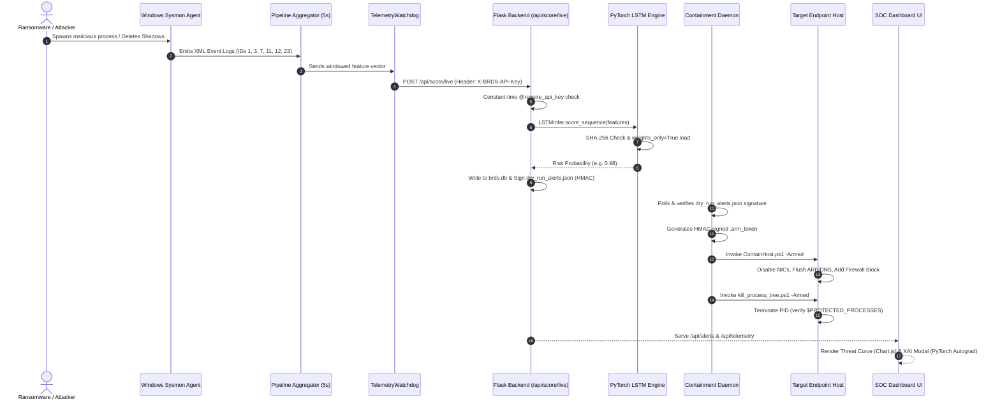

# Behavioral Ransomware Detection System (BRDS-PEC)
## Application Workflow & End-to-End Execution Flow

**Scope:** Visual & Operational Workflows across Ingestion, Inference, Containment, and Dashboard UI  

---

## 1. End-to-End System Execution Sequence

---

## 2. Detailed Subsystem Workflows

### 2.1 Telemetry Ingestion & Watchdog Workflow
1. **Sysmon Telemetry Processing:** `evtx_reader.py` parses native `.evtx` files or live ETW log buffers.
2. **5-Second Windowing:** `temporal_aggregator.py` groups event streams into 5-second sliding windows.
3. **Heartbeat Health Monitoring:** `watchdog.py` registers ingestion timestamp. If event arrival gaps exceed 30 seconds, `TelemetryWatchdog` updates status to `SENSOR_SILENCED` and exposes failure state at `GET /api/health`.

### 2.2 Ingestion API & Model Scoring Workflow
1. **Header Authentication:** Incoming HTTP requests to `POST /api/score/live` are intercepted by `@require_api_key`. Validates `X-BRDS-API-Key` using constant-time string comparison (`hmac.compare_digest`).
2. **PyTorch Neural Inference:** `LSTMInfer` loads input sequence, applies `StandardScaler` sidecar, front-pads short sequences with feature means, and calculates threat probability.
3. **Dual Persistence & HMAC Signing:** Saves scored feature vectors to `brds.db` and writes alerts ($\ge 0.85$) to `dry_run_alerts.json` signed with HMAC-SHA256.

### 2.3 Containment Daemon Execution Workflow
1. **Signature Verification:** `trigger_daemon.py` polls `dry_run_alerts.json` and verifies HMAC signature (`verify_and_load`).
2. **Arm Token Issuance:** Upon successful verification, creates single-use `.arm_token`.
3. **Host Isolation:** Executes `ContainHost.ps1 -Armed` to isolate network interfaces.
4. **Process Tree Termination:** Executes `kill_process_tree.ps1 -Armed -ProcessId <PID>` to collapse ransomware sub-trees safely.

### 2.4 SOC Dashboard & XAI Workflow
1. **Telemetry Stream:** `telemetry_stream.js` polls `GET /api/telemetry` and updates event count metrics.
2. **Risk Timeline Chart:** `risk_timeline.js` pushes latest risk score into Chart.js 30-window rolling canvas.
3. **Incident Log & Isolation:** `incident_log.js` renders active threat cards and enables manual host containment.
4. **XAI Modal Analysis:** `xai_modal.js` queries `GET /api/explanations/<alert_id>`, receiving PyTorch autograd feature attributions (`explanation_source: "lstm_gradient"`), and renders dynamic feature importance bars.
